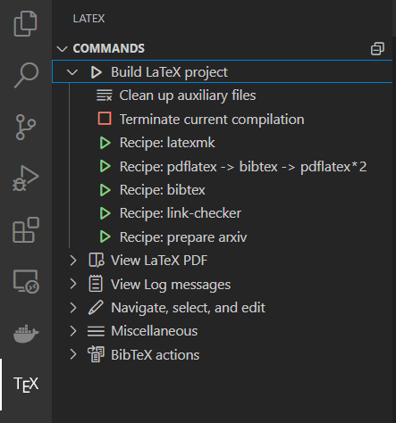

# VS Code LaTeX Devcontainer

Devcontainer using LaTeX with VS Code featuring

- Common LaTeX plugins
- Github and Gitlab CI
- one-click arXiv export
- one-click PDF URL check

_Note_: No local LaTeX installation is needed, however, [VS Code](https://code.visualstudio.com/) and [Docker](https://docs.docker.com/get-docker/) need to be installed to use this.

## Usage


Step by Step:

- Install VS Code Devcontainer extension `ms-vscode-remote.remote-containers`
- Clone repo or add submodule with path `.devcontainer` into your project
  ```shell
  git clone https://github.com/a-nau/latex-devcontainer.git .devcontainer
  git submodule add https://github.com/a-nau/latex-devcontainer.git .devcontainer
  ```
- Press `F1` (or `CTRL + SHIFT + P`) and select `Dev Containers: Rebuild and Reopen Container`
- (optional) rename main Texfile to `root.tex` or adjust CI configs if you want to use the CIs
- Commit the files copied during the Devcontainer setup (`settings.json`, `.gitlab-ci.yml`, `latex_build.yml`)
- If you do not see the following latex command menu, try reloading the window
<p align="center">
    
</p>

## Credits

- Uses the [danteev/texlive](https://github.com/dante-ev/docker-texlive) Docker image as base: [MIT License](https://github.com/dante-ev/docker-texlive/blob/main/LICENSE)
- Uses [arxiv-latex-cleaner](https://github.com/google-research/arxiv-latex-cleaner): [Apache 2.0 License](https://github.com/google-research/arxiv-latex-cleaner/blob/main/LICENSE)
- Uses [pdf-link-checker](https://github.com/a-nau/pdf-link-checker): [MIT License](https://github.com/a-nau/pdf-link-checker/blob/main/LICENSE)
- Uses [cvpr-latex-template](https://github.com/apoorvkh/cvpr-latex-template) as example for the `.gif`

Unless stated otherwise, this project is licensed under the [MIT license](LICENSE).